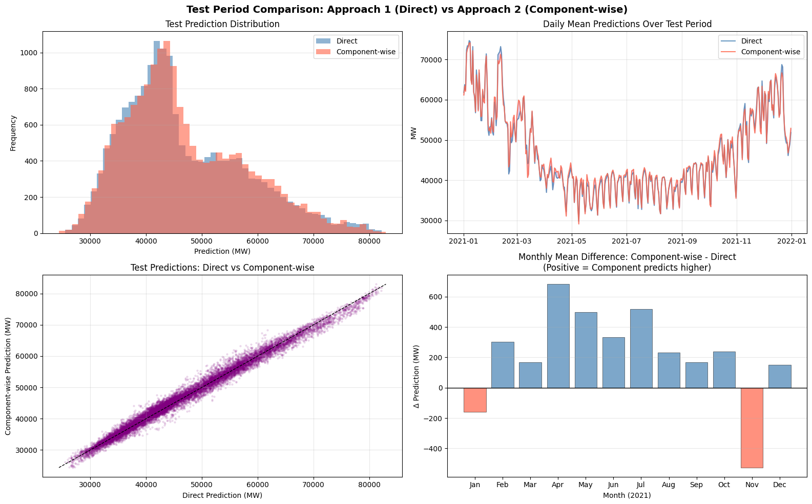

# Kaggle Electricity Balance (Load - Renewable) Forecast 

This is a self-study project based on data from the Kaggle competition “Not Controllable Electricity Balance Forecast.” The goal is to strengthen my machine learning skills and explore how AI/ML can be applied in the energy sector.

This repository contains an end-to-end data processing and machine learning solution for forecasting `Electricity_balance_not_controllable` based on weather conditions (temperature, nebulosity, wind) and calendar data. 

## Dataset Scope

- `train.csv`: 137,376 rows, 24 columns, 30-minute intervals from 2013-03-02 to 2020-12-31
- `test.csv`: 17,520 rows, 20 columns, 30-minute intervals from 2021-01-01 to 2021-12-31
- Missing values: none in either train or test

The competition target follows an exact physical identity:

`Electricity_balance_not_controllable = Load - Solar_power - Wind_power`

## Selected EDA Outputs (from 01_eda.ipynb)

- Dataset shape: `train: (137376, 24)`, `test: (17520, 20)`
- Train time range (from `describe()` on `date`): `2013-03-02 00:00:00` to `2020-12-31 23:30:00`
- Data quality check: missing values are `0` for all train columns
- Core target statistics from train:
   - `Electricity_balance_not_controllable`: mean `49,609.25`, std `11,471.33`, min `23,428`, max `91,969`
   - `Load`: mean `53,505.24`, std `11,656.99`, min `29,124`, max `96,272`
   - `Solar_power`: mean `1,014.71`, std `1,525.48`, min `0`, max `7,551`
   - `Wind_power`: mean `2,881.28`, std `2,415.05`, min `21`, max `13,552`

## TRY #1:

I tried two different approaches:
  * **Approach 1 (Direct Forecasting):** Trains a single `HistGradientBoostingRegressor` directly against the target balance.
  * **Approach 2 (Component Forecasting):** Trains separated specialized models for Load, Solar, and Wind individually (using Linear & Tree models), then mathematically subtracts them to derive the target balance.

Results: `baseline_models.py` empirically demonstrates **Approach 1 (Direct Forecasting)** to be substantially superior. 

While Component forecasting is physically intuitive, it suffers from heavy *compounding errors*. Furthermore, sophisticated Tree models in the Direct approach easily capture dynamic real-world caps—such as wind turbine "cut-out" speeds where energy production drops rapidly to $0$ at very high wind velocities—which sub-models struggle to isolate securely.

## TRY #2:

Try different ways to improve model at component level: LOAD, SOLAR and WIND.  Comppppounding errors significantly reduced. Component forecasting approach is the final winner after fine tuning each model.
==========================================================================================
FINAL COMPARISON SUMMARY
==========================================================================================

📊 VALIDATION SET (Last 6 months of training data)
------------------------------------------------------------------------------------------
Metric               Approach 1 (Direct)       Approach 2 (Component)    Winner              
------------------------------------------------------------------------------------------
MAE                               2,316 MW               2,078 MW  Component-wise ✓    
RMSE                              3,059 MW               2,725 MW  Component-wise ✓    
MAPE                               5.10%                  4.64%    Component-wise ✓    
MAE/Mean Ratio                     5.19%                  4.66%    —                   

## Data Findings

| Finding | Detail |
|---|---|
| **Target identity** | `Balance = Load - Solar - Wind` (exact, zero error) |
| **Strong seasonality** | Load is around 69-70k MW in January and around 42k MW in August (about 65% swing) |
| **Daily cycle** | Clear morning ramp (06:00-09:00) and evening peak (18:00-21:00) |
| **Temperature effect** | U-shaped load response: colder weather increases heating demand, hotter weather increases cooling demand |
| **Solar pattern** | Solar is zero at night, strongest at summer midday; `nebulosity_by_solar_power_weights` is highly informative |
| **Wind pattern** | Wind generation is highly volatile; `wind_by_wind_power_weights` captures geographic wind signal |
| **2020 shift** | Mean load in 2020 is lower than 2016-2019 by roughly 4k MW |
| **Train/test drift** | Small distribution shift appears in temperature in 2021 test data |

## Analysis Notebooks

- `01_eda.ipynb`: exploratory analysis, trend/seasonality checks, weather-target relationship plots
- `02_features.ipynb`: feature engineering pipeline and feature export
- `03_model_lgbm.ipynb`: LightGBM baseline with time-based validation and submission generation. Compared two approaches

