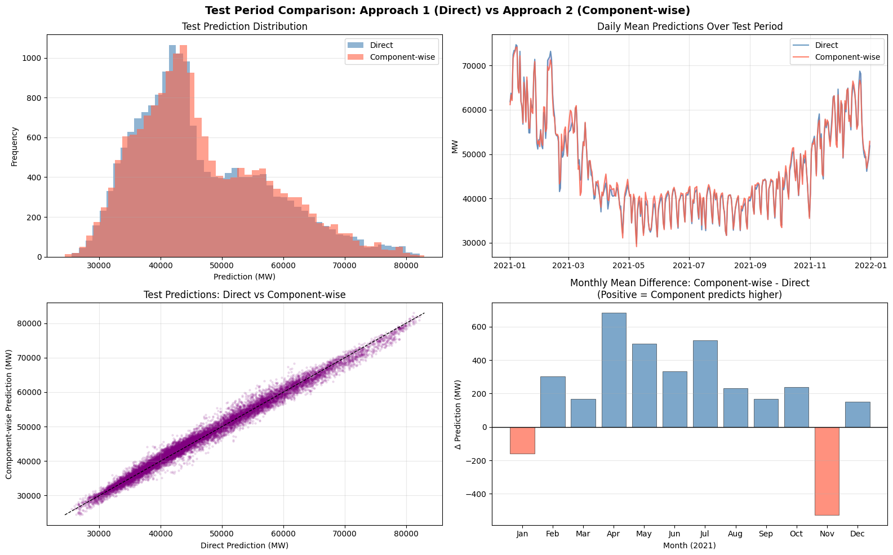
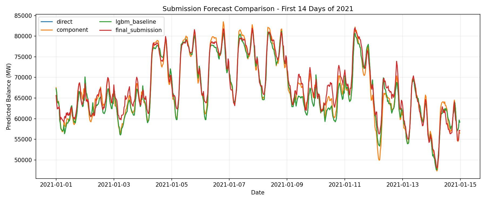
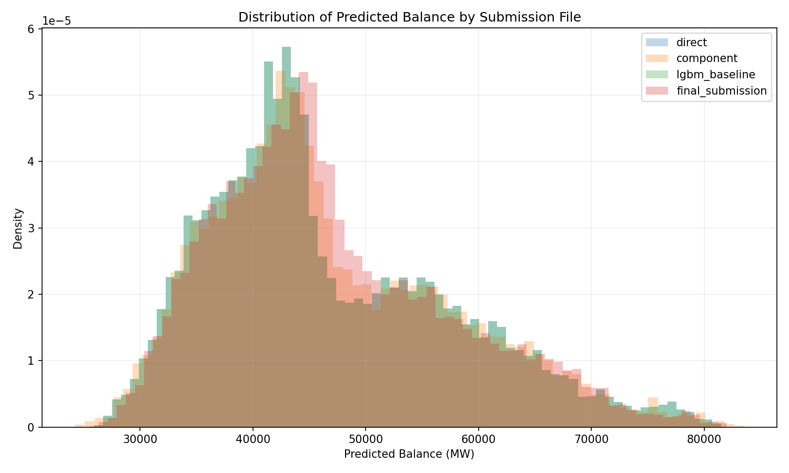
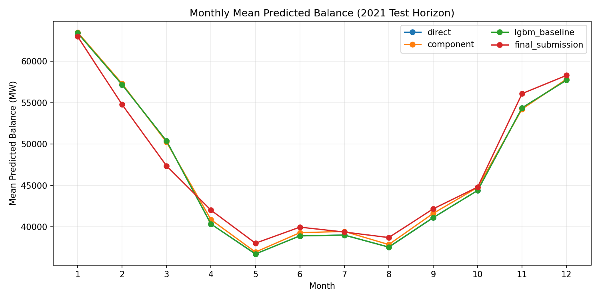
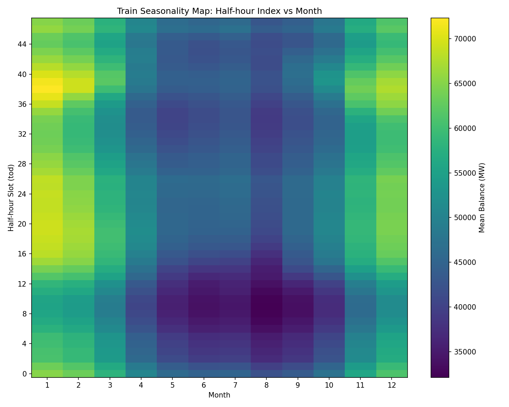
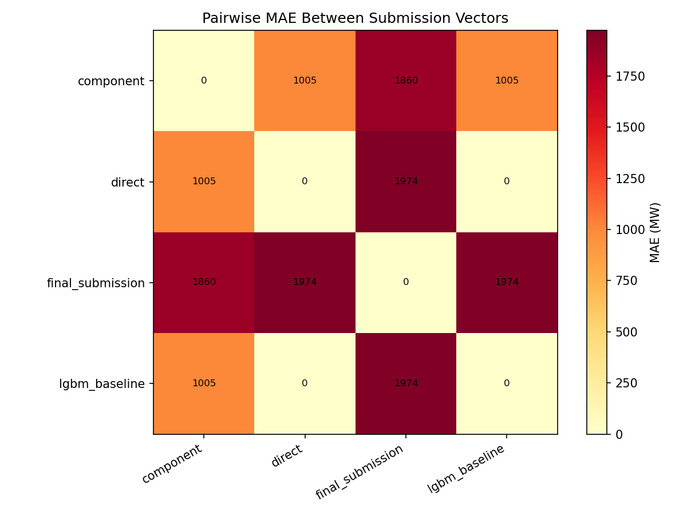
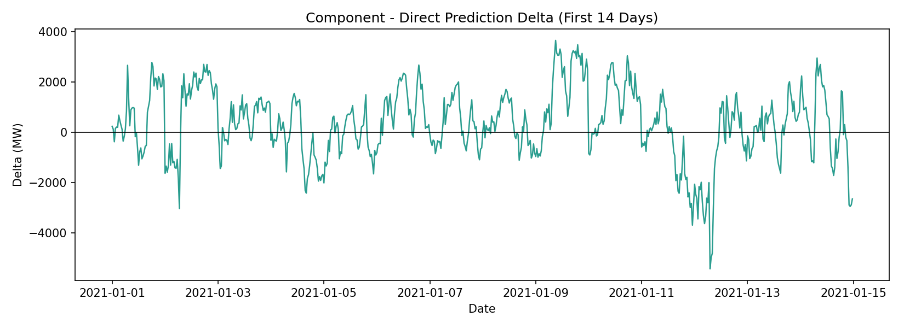

# Kaggle Electricity Balance (Load - Renewable) Forecast 

This is a self-directed learning project based on the Kaggle competition “Not Controllable Electricity Balance Forecast”. The objective was to strengthen my machine learning skills and explore the application of AI/ML techniques in the energy sector. 

This repository contains an end-to-end data processing and machine learning solution for forecasting `Electricity_balance_not_controllable` based on weather conditions (temperature, nebulosity, wind) and calendar data. 

## Dataset Scope

- `train.csv`: 137,376 rows, 24 columns, 30-minute intervals from 2013-03-02 to 2020-12-31
- `test.csv`: 17,520 rows, 20 columns, 30-minute intervals from 2021-01-01 to 2021-12-31
- Missing values: none in either train or test

The competition target follows an exact physical identity:

`Electricity_balance_not_controllable = Load - Solar_power - Wind_power`

## Selected EDA Outputs (from 01_eda.ipynb)

- Dataset shape: `train: (137376, 24)`, `test: (17520, 20)`
- Train time range (from `describe()` on `date`): `2013-03-02 00:00:00` to `2020-12-31 23:30:00`
- Data quality check: missing values are `0` for all train columns
- Core target statistics from train:
   - `Electricity_balance_not_controllable`: mean `49,609.25`, std `11,471.33`, min `23,428`, max `91,969`
   - `Load`: mean `53,505.24`, std `11,656.99`, min `29,124`, max `96,272`
   - `Solar_power`: mean `1,014.71`, std `1,525.48`, min `0`, max `7,551`
   - `Wind_power`: mean `2,881.28`, std `2,415.05`, min `21`, max `13,552`

## TRY #1:

I tried two different approaches:
  * **Approach 1 (Direct Forecasting):** Trains a single `HistGradientBoostingRegressor` directly against the target balance.
  * **Approach 2 (Component Forecasting):** Trains separated specialized models for Load, Solar, and Wind individually (using Linear & Tree models), then mathematically subtracts them to derive the target balance.

Results: `baseline_models.py` empirically demonstrates **Approach 1 (Direct Forecasting)** to be substantially superior. 

While Component forecasting is physically intuitive, it suffers from heavy *compounding errors*. Furthermore, sophisticated Tree models in the Direct approach easily capture dynamic real-world caps—such as wind turbine "cut-out" speeds where energy production drops rapidly to $0$ at very high wind velocities—which sub-models struggle to isolate securely.

## TRY #2:

Try different ways to improve model at component level: LOAD, SOLAR and WIND.  Comppppounding errors significantly reduced. Component forecasting approach is the final winner after fine tuning each model.

------------------------------------------------------------------------------------------
FINAL COMPARISON SUMMARY
==========================================================================================

📊 VALIDATION SET (Last 6 months of training data)
------------------------------------------------------------------------------------------
Metric               Approach 1 (Direct)       Approach 2 (Component)    Winner              
------------------------------------------------------------------------------------------
MAE                               2,316 MW               2,078 MW  Component-wise ✓    
RMSE                              3,059 MW               2,725 MW  Component-wise ✓    
MAPE                               5.10%                  4.64%    Component-wise ✓    
MAE/Mean Ratio                     5.19%                  4.66%    —                   

## Data Findings

| Finding | Detail |
|---|---|
| **Target identity** | `Balance = Load - Solar - Wind` (exact, zero error) |
| **Strong seasonality** | Load is around 69-70k MW in January and around 42k MW in August (about 65% swing) |
| **Daily cycle** | Clear morning ramp (06:00-09:00) and evening peak (18:00-21:00) |
| **Temperature effect** | U-shaped load response: colder weather increases heating demand, hotter weather increases cooling demand |
| **Solar pattern** | Solar is zero at night, strongest at summer midday; `nebulosity_by_solar_power_weights` is highly informative |
| **Wind pattern** | Wind generation is highly volatile; `wind_by_wind_power_weights` captures geographic wind signal |
| **2020 shift** | Mean load in 2020 is lower than 2016-2019 by roughly 4k MW |
| **Train/test drift** | Small distribution shift appears in temperature in 2021 test data |

## Analysis Notebooks

- `01_eda.ipynb`: exploratory analysis, trend/seasonality checks, weather-target relationship plots
- `02_features.ipynb`: feature engineering pipeline and feature export
- `03_model_lgbm.ipynb`: LightGBM baseline with time-based validation and submission generation. Compared two approaches

## Additional Results Snapshot (2026-06)

Below are additional diagnostics generated from the submission files currently in this repo:

- `data/submission_approach1_direct.csv`
- `data/submission_approach2_component.csv`
- `data/submission_lgbm_baseline.csv`
- `data/submission.csv`

All summary artifacts are saved in:

- `docs/submission_stats.csv`
- `docs/submission_agreement.csv`

### Submission Distribution Summary

| Submission | Rows | Mean (MW) | Std (MW) | Min | P05 | Median | P95 | Max |
|---|---:|---:|---:|---:|---:|---:|---:|---:|
| component | 17,520 | 46,950.77 | 10,836.27 | 24,258.32 | 32,430.41 | 44,486.98 | 67,520.33 | 83,500.17 |
| direct | 17,520 | 46,718.18 | 10,876.00 | 25,904.60 | 32,375.08 | 43,917.75 | 67,352.32 | 81,501.59 |
| final_submission | 17,520 | 47,016.24 | 10,446.88 | 25,508.18 | 32,885.01 | 44,952.16 | 67,298.09 | 82,004.13 |
| lgbm_baseline | 17,520 | 46,718.18 | 10,876.00 | 25,904.60 | 32,375.08 | 43,917.75 | 67,352.32 | 81,501.59 |

### Pairwise Submission Agreement

Vector agreement is measured using MAE between two prediction vectors and Pearson correlation:

| Left | Right | MAE Between Predictions (MW) | Correlation |
|---|---|---:|---:|
| direct | lgbm_baseline | 0.00 | 1.0000 |
| direct | component | 1,005.19 | 0.9930 |
| component | lgbm_baseline | 1,005.19 | 0.9930 |
| component | final_submission | 1,859.65 | 0.9709 |
| direct | final_submission | 1,973.72 | 0.9688 |
| lgbm_baseline | final_submission | 1,973.72 | 0.9688 |

Observation: `submission_lgbm_baseline.csv` and `submission_approach1_direct.csv` are identical in this repository snapshot.

### New Graphs

#### Forecast Comparison (First 14 Days)

This chart helps visually compare how each approach tracks intra-day and day-to-day swings early in the test year.

#### Prediction Distribution Comparison

Useful to detect over-smoothing, extreme tails, and central tendency shifts between approaches.

#### Monthly Mean Profile (2021 Test Horizon)

Shows seasonality shape consistency across generated submissions.

#### Train Seasonality Heatmap

Mean target intensity by month and half-hour slot, showing combined daily and annual seasonality patterns.

### Additional Diagnostics (2026-06-26)

Using the latest submission candidates in this repository, the following additional diagnostics were generated and saved to:

- `docs/submission_extra_stats.csv`
- `docs/figures/submission_pairwise_mae_heatmap.png`
- `docs/figures/submission_component_minus_direct_14d.png`

#### Component vs Direct Disagreement Summary

| Pair | Mean Abs Diff (MW) | P50 Abs Diff (MW) | P90 Abs Diff (MW) | P95 Abs Diff (MW) | Max Abs Diff (MW) |
|---|---:|---:|---:|---:|---:|
| component vs direct | 1,005.19 | 802.76 | 2,112.12 | 2,626.63 | 7,146.55 |

Interpretation: while average disagreement is around `1,005 MW`, tail disagreement can exceed `7,000 MW`, which means blending or calendar-conditioned weighting can still materially change final trajectories.

#### Pairwise MAE Heatmap Across Submission Vectors

This heatmap makes it easier to compare candidate distance at a glance and identify near-duplicates.

#### Component Minus Direct Delta (First 14 Days)

This chart isolates where component and direct methods diverge at the start of the test horizon.

### Extra Notes

- The final submission has slightly lower spread (`std`) than direct/component candidates, suggesting a somewhat smoother forecast profile.
- The component and direct submissions are still highly correlated (`~0.993`), but differ enough (`~1,005 MW` MAE) to produce meaningfully distinct trajectories.

## Experiment And Submission Logging

The training and submission scripts now support automatic CSV logging so each run is traceable.

### Baseline evaluation logs

- Script: `src/baseline_models.py`
- Default log file: `docs/experiment_log.csv`
- Logged fields include:
  - run metadata (`run_id`, `run_ts_utc`, `scope`, `split_date`)
  - model config (`model_type`, `approach`)
  - split sizes (`train_size`, `val_size`)
  - metrics (`mae`, `rmse`, `mape`)
  - winner markers (`winner_on_mae`, `is_winner`)

Example commands:

- `python src/baseline_models.py`
- `python src/baseline_models.py --rolling-splits 3 --val-months 6`
- `python src/baseline_models.py --log-path docs/my_experiment_log.csv`
- `python src/baseline_models.py --disable-log`

### Submission generation logs

- Script: `src/generate_submission.py`
- Default log file: `docs/submission_run_log.csv`
- Logged fields include:
  - run metadata (`run_id`, `run_ts_utc`)
  - generation config (`approach`, `model_type`, `blend_weight_component`)
  - output details (`out_path`, `rows`)
  - prediction summary statistics (`pred_mean`, `pred_std`, `pred_min`, `pred_p05`, `pred_median`, `pred_p95`, `pred_max`)

Example commands:

- `python src/generate_submission.py --approach component --model-type lgbm`
- `python src/generate_submission.py --approach blend --blend-weight-component 0.7`
- `python src/generate_submission.py --log-path docs/my_submission_run_log.csv`
- `python src/generate_submission.py --disable-log`

